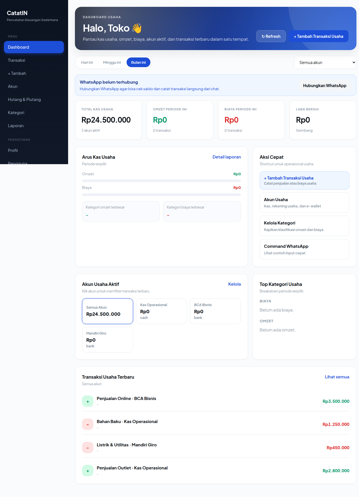

# CatatIN: Multi-Tenant Financial Management Platform

[](https://nodejs.org/)
[](https://expressjs.com/)
[](https://www.prisma.io/)
[](https://www.postgresql.org/)
[](https://react.dev/)
[](https://www.docker.com/)
[](LICENSE)

A multi-tenant personal and small-business financial recording platform featuring conversational WhatsApp bot input, a responsive React web dashboard, and a native Android client. Built with Node.js, Express, Prisma ORM, and PostgreSQL.

---

<p align="center">
  
</p>

---

## Architecture Overview

CatatIN decouples data ingestion across multiple user touchpoints while enforcing strict tenant isolation and transactional integrity at the database layer.

```text
 ┌─────────────────────────────────────────────────────────────┐
 │                         CLIENTS                             │
 │  ┌─────────────────┐  ┌────────────────┐  ┌──────────────┐  │
 │  │  WhatsApp User  │  │ React Web App  │  │ Android App  │  │
 │  │ (Personal/Group)│  │ (Vite/Tailwind)│  │ (Kotlin/Jet) │  │
 │  └────────┬────────┘  └───────┬────────┘  └──────┬───────┘  │
 └───────────┼───────────────────┼──────────────────┼──────────┘
             │                   │                  │           
             ▼ Webhook           ▼ REST API         ▼ REST API  
 ┌───────────────────────┐ ┌───────────────────────────────────┐
 │   WhatsApp Gateway    │ │          Reverse Proxy            │
 │ (WAHA / WA-AKG / Mock)│ │          (Nginx / Vite)           │
 └───────────┬───────────┘ └────────────────┬──────────────────┘
             │                              │                   
             └──────────────┬───────────────┘                   
                            ▼                                   
 ┌─────────────────────────────────────────────────────────────┐
 │                    CATATIN BACKEND (API)                    │
 │                                                             │
 │  • Auth Middleware (JWT, Bcrypt, WhatsApp OTP, RBAC)        │
 │  • Conversational Parser (Heuristic Regex + OpenAI fallback)│
 │  • Financial Ledger (Atomic Prisma $transaction)            │
 │  • Debt & Receivables Tracking Engine                       │
 │  • Report Generator (ExcelJS multi-sheet exports)           │
 └──────────────────────────────┬──────────────────────────────┘
                                │                               
             ┌──────────────────┴──────────────────┐            
             ▼                                     ▼            
 ┌────────────────────────┐             ┌──────────────────────┐
 │    PostgreSQL (16)     │             │      Redis (7)       │
 │ Multi-Tenant Ledger DB │             │ OTP & Rate Limiting  │
 └────────────────────────┘             └──────────────────────┘
```

---

## Core Capabilities

### 1. Conversational WhatsApp Ledger
- Direct and group chat interactions via WhatsApp adapters (WAHA, WA-AKG, or internal mock).
- Flexible Indonesian syntax parsing: supports natural denominations (`50rb`, `50k`, `1.5jt`, `2.500.000`) and relative date formats (`kemarin`, `hari ini`).
- Two-step confirmation flow (YA / BATAL) with automatic 10-minute timeout to prevent accidental writes.
- Real-time balance queries, transaction logs, category filters, and inter-account transfers.

### 2. Multi-Tenant Architecture & Security
- Isolated data partitioning: every business query is scoped by `tenantId`.
- Passwordless authentication via 6-digit WhatsApp OTP with bcrypt hashing, rate limiting, and attempt limits.
- Role-Based Access Control (RBAC): `platform_admin`, `owner`, `admin`, and `member`.
- Security hardening with Helmet HTTP headers, CORS validation, and rate limiting.

### 3. Financial Integrity
- Double-entry accounting principles: balance modifications are executed inside Prisma `$transaction` blocks.
- Non-destructive audit trail: transactions use void flags instead of hard deletes.
- Support for multiple account types: Cash, Bank, E-Wallet, Debt, and Receivables.

### 4. Comprehensive Documentation
Built adhering to the international **Diátaxis Framework**:
- [Tutorials](docs/tutorials/): Step-by-step local setup, first transaction, and mock testing.
- [How-To Guides](docs/how-to/): In-depth guides for deployment, migration rollbacks, adding API routes, and WhatsApp providers.
- [Explanation](docs/explanation/): Technical deep dives into multi-tenancy, financial domain models, and AI parser architecture.
- [Reference](docs/reference/): Database schema, API specifications, and command grammars.

---

## Project Structure

```text
catatin/
├── backend/            # Express API, Prisma ORM, and WhatsApp webhook handlers
│   ├── prisma/         # PostgreSQL schema definitions and seed data
│   ├── scripts/        # Administrative utility scripts
│   └── src/            # Application routes, middleware, and services
├── frontend/           # React 18 SPA built with Vite and Tailwind CSS
│   ├── src/components/ # Reusable UI components
│   └── src/pages/      # Dashboard, Ledger, Admin, and Settings views
├── mobile/             # Native Android mobile client built with Jetpack Compose
└── docs/               # Diátaxis framework technical documentation
```

---

## Quickstart (Docker Compose)

The easiest way to run the full stack locally:

```bash
# 1. Clone repository
git clone https://github.com/oggyay/catatin.git
cd catatin

# 2. Configure environment
cp .env.docker.example .env

# 3. Start services (Frontend, Backend, PostgreSQL, Redis)
docker compose up -d --build

# 4. Seed initial database records
docker compose exec backend npm run db:seed
```

Access points:
- **Web Dashboard:** `http://localhost:8080`
- **Backend API:** `http://localhost:4000`

Default demo credentials:
- **Demo Business Owner:** `6281234567890` (OTP printed to backend logs)
- **Platform Administrator:** `6289999999999`

---

## Manual Local Development

### Backend Setup

```bash
cd backend
cp .env.example .env
npm install
npx prisma migrate dev
npm run db:seed
npm run dev
```

### Frontend Setup

```bash
cd frontend
npm install
npm run dev
```

Web interface will be available at `http://localhost:5173`.

---

## Testing WhatsApp Ingestion Without Gateway

CatatIN includes a built-in mock provider for local development. You can simulate WhatsApp events using standard curl commands:

```bash
# Query balance
curl -X POST http://localhost:4000/api/webhooks/whatsapp \
  -H "Content-Type: application/json" \
  -d '{"from":"6281234567890","body":"saldo"}'

# Record an expense
curl -X POST http://localhost:4000/api/webhooks/whatsapp \
  -H "Content-Type: application/json" \
  -d '{"from":"6281234567890","body":"keluar 50rb makan siang"}'

# Confirm pending transaction
curl -X POST http://localhost:4000/api/webhooks/whatsapp \
  -H "Content-Type: application/json" \
  -d '{"from":"6281234567890","body":"ya"}'
```

Outgoing bot responses are logged directly to the backend terminal console.

---

## License

This project is licensed under the MIT License. See the [LICENSE](LICENSE) file for details.
