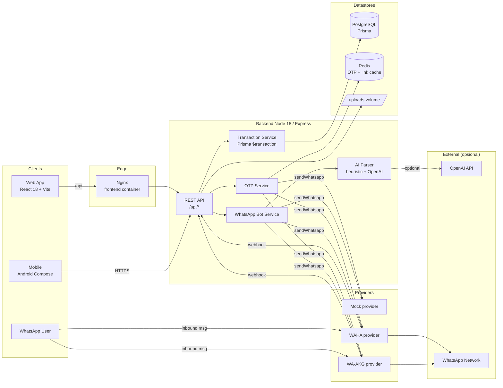
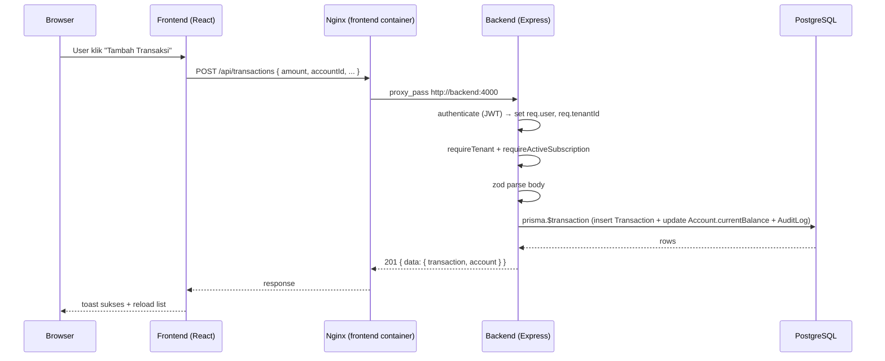
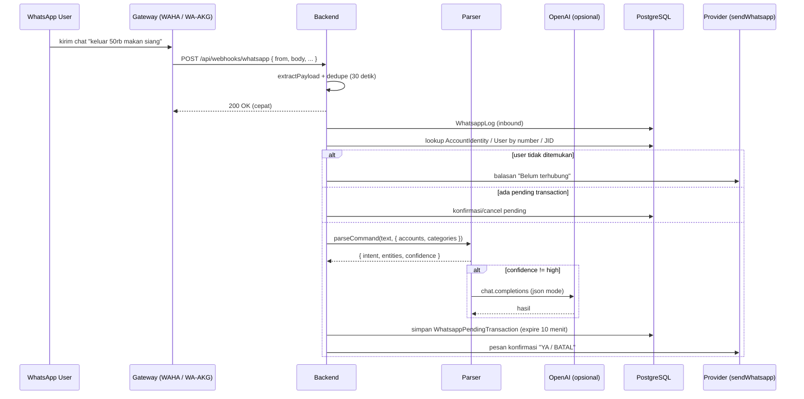
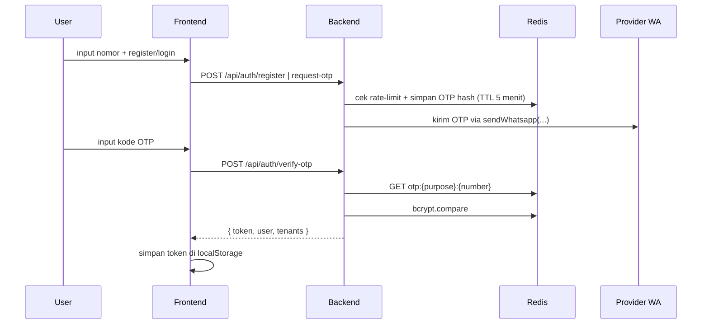

# 2. Arsitektur Sistem

> Kuadran: **Explanation** — peta komponen, alur data, dan batas tanggung jawab tiap modul.

## Peta komponen



## Daftar service runtime

`docker-compose.yml` mendefinisikan empat service yang bekerja sama:

| Service | Image / build | Port host | Tanggung jawab |
| --- | --- | --- | --- |
| `postgres` | `postgres:16-alpine` | internal | Penyimpanan utama. Volume `postgres_data`. |
| `redis` | `redis:7-alpine` | internal | OTP, rate limit OTP, cache link request. Volume `redis_data`. |
| `backend` | `./backend` (Node 18) | internal `4000` | REST API, WhatsApp bot, parser, OTP, file upload. Volume `uploads_data`. |
| `frontend` | `./frontend` (Nginx) | `${WEB_PORT:-8080}` | Static React build + reverse proxy `/api` & `/uploads` → backend. |

Backend menjalankan `prisma migrate deploy` saat startup (tergantung Dockerfile / orchestrator) dan health check `GET /health`.

## Lapisan backend

Backend mengikuti pola Express konvensional, dipisah per concern:

```
backend/src/
├── server.js               # bootstrap Express, helmet, cors, rate limit, mount routes
├── config/
│   ├── prisma.js           # singleton PrismaClient
│   ├── redis.js            # lazy connect Redis
│   ├── plans.js            # batas plan (free/basic/pro × personal/umkm)
│   └── defaults.js         # kategori & akun default seed/onboarding
├── middleware/auth.js      # authenticate, requireTenant, requireActiveSubscription, requirePlatformAdmin, requireRole
├── routes/                 # 9 router modul (auth, dashboard, accounts, ...)
├── services/
│   ├── otp.service.js
│   ├── transaction.service.js   # createTransactionAtomic, createTransferAtomic, voidTransactionAtomic, updateTransactionAtomic
│   ├── whatsapp-bot.service.js  # handleIncomingMessage + intent handler
│   └── whatsapp/
│       ├── index.js             # selektor provider via WA_PROVIDER
│       ├── parser.js            # heuristic + OpenAI
│       ├── mock.provider.js
│       ├── waha.provider.js
│       └── waakg.provider.js
└── utils/                  # phone, jwt, period, format, error, date-parser, auth-user
```

Aturan pemisahan:

- **Routes** mengurus IO (validasi input via `zod`, autentikasi, status code). Tidak boleh menulis ke database tanpa lewat service untuk operasi yang melibatkan saldo atau transaksi.
- **Services** mengandung business logic dan menggunakan `prisma.$transaction` untuk konsistensi (lihat `transaction.service.js`).
- **Config** dan **utils** murni stateless.
- **Middleware `auth.js`** adalah satu-satunya tempat user/tenant context dilampirkan ke `req` (`req.user`, `req.tenantId`, `req.identity`, `req.member`).

## Alur data: web request



Detail middleware authenticate ada di `backend/src/middleware/auth.js`. Logika atomik transaksi ada di `backend/src/services/transaction.service.js:21-127`.

## Alur data: pesan WhatsApp masuk



Webhook didesain agar **menjawab 200 OK secepat mungkin** lalu memproses pesan async (`webhooks.routes.js:114-118`). Ini mencegah retry storm dari gateway.

## Alur data: registrasi & login OTP



OTP **tidak** disimpan di PostgreSQL pada path utama; hanya di Redis (lihat [Otentikasi & OTP](./05-otentikasi-otp.md)). Tabel `Otp` di skema disiapkan untuk audit / fallback, tetapi alur saat ini menggunakan Redis.

## Frontend & mobile

### Frontend web

- React 18 + Vite, **tanpa state-management library** (cukup `useState` + `useContext`).
- Auth context (`frontend/src/context/AuthContext.jsx`) menyimpan `user`, `tenants`, dan menyediakan `login`, `logout`, `switchTenant`.
- HTTP client `frontend/src/lib/api.js` (axios) menambahkan token otomatis dan menangani redirect 401 → `/login`, 403 langganan → `/settings/subscription`.
- Layout utama `AppLayout.jsx` membedakan dua mode: user biasa vs platform admin (lihat `App.jsx`).

### Mobile Android

- Kotlin + Jetpack Compose + Ktor + Koin DI.
- Sumber API base URL hardcoded di `BuildConfig.API_BASE_URL` = `http://10.0.2.2:4000` (alamat host emulator).
- Struktur modul mirror dengan halaman web: `screens/{auth,dashboard,transactions,accounts,categories,reports,settings}` masing-masing dengan `Screen` + `ViewModel`.
- Status: implementasi mobile masih awal dan belum lengkap. Lihat [Reference: mobile-struktur](../reference/mobile-struktur.md).

## Penyimpanan dan invariant

- **PostgreSQL** memegang semua data bisnis. Skema dikelola oleh Prisma (`backend/prisma/schema.prisma`).
- **Saldo akun** (`Account.currentBalance`) **tidak dihitung dari transaksi setiap saat**. Saldo disimpan dan **diupdate atomik** bersama insert/update/void transaksi (lihat [Domain keuangan](./04-domain-keuangan.md)).
- **Redis** digunakan hanya untuk: OTP (TTL 5 menit), rate-limit OTP per nomor (TTL 15 menit), dan link-request WhatsApp (TTL 5 menit). Kehilangan Redis tidak menghilangkan data bisnis tapi mengganggu login.
- **File upload** (bukti transaksi) disimpan di volume `uploads_data` dan diakses lewat `GET /uploads/...` yang di-proxy Nginx.

## Keamanan dasar

- `helmet`, `cors` permisif (di-tune di reverse proxy), rate limit dua jalur:
  - `/api/auth/*` — 60 req / 15 menit / IP (`server.js:48-52`).
  - `/api/webhooks/*` — 120 req / menit / IP (`server.js:54-59`).
- OTP rate limit per nomor: default 3 permintaan / 15 menit (`OTP_RATE_LIMIT_*`).
- JWT dengan TTL `JWT_EXPIRES_IN` default `7d`. Logout client-side (token dibuang); tidak ada token blacklist.
- Multi-tenant scoping dilakukan di setiap query bisnis dengan filter `tenantId: req.tenantId`. Tidak ada DB-level RLS.

## Apa yang sengaja dihindari

Beberapa keputusan arsitektur yang penting saat redesign:

- **Tanpa ORM lain** — Prisma tunggal, tidak ada raw SQL kecuali aggregate Prisma.
- **Tanpa antrian (queue)** — bot WhatsApp diproses inline. Cocok untuk volume kecil; jika scale, lihat ADR-007 di [keputusan arsitektur](./09-keputusan-arsitektur.md).
- **Tanpa session server** — JWT stateless. Mempermudah horizontal scale tapi mempersulit revoke.
- **Tanpa GraphQL/RPC** — REST sederhana, JSON body. Frontend dan mobile pakai axios/Ktor langsung.

## Lanjut baca

- [Multi-tenant](./03-model-multitenant.md) — entitas inti: `AccountIdentity`, `TenantMember`, `User`.
- [Domain keuangan](./04-domain-keuangan.md) — invariant saldo dan tipe transaksi.
- [Adapter WhatsApp](./08-adapter-wa-provider.md) — kontrak provider.
- [ADR ringkas](./09-keputusan-arsitektur.md) — kenapa pilihan-pilihan di atas.
