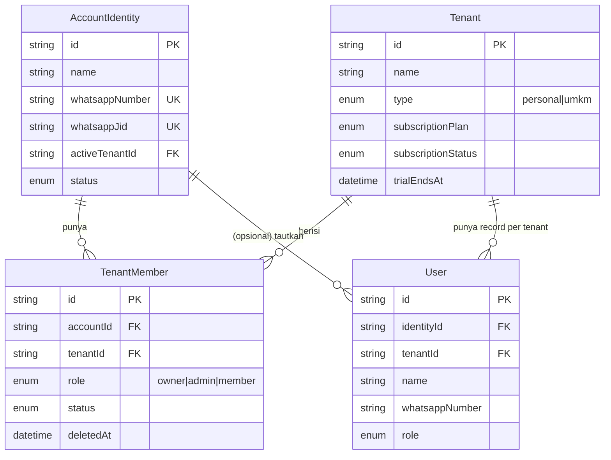

# 3. Model Multi-Tenant

> Kuadran: **Explanation** — kenapa CatatIN punya tiga entitas (`AccountIdentity`, `TenantMember`, `User`) dan bukan sekadar tabel `User` tunggal.

## Pertanyaan inti

Satu nomor WhatsApp seringkali "milik" lebih dari satu konteks keuangan:

> "Saya punya catatan kas pribadi dan kas warung. Keduanya butuh nomor WA saya, tapi saya tidak mau saldo warung tercampur dengan pribadi."

CatatIN menyelesaikan ini dengan memisahkan **identitas** (siapa Anda di WhatsApp) dari **keanggotaan** (di tenant mana Anda bekerja saat ini).

## Tiga entitas, tiga peran berbeda

### `AccountIdentity` — siapa Anda di WhatsApp
- Satu baris per nomor WhatsApp unik (`whatsappNumber` `@unique`).
- Menyimpan `whatsappJid` (ID asli dari provider, misal `6281234567890@c.us`) untuk routing pesan.
- Menyimpan `activeTenantId`: tenant default saat user login atau menerima command WA.
- Memegang status `active` / `inactive`. Saat inactive, login ditolak.

### `TenantMember` — keanggotaan di sebuah tenant
- Junction antara `AccountIdentity` dan `Tenant`.
- Punya **`role`** (`owner`, `admin`, `member`) dan **`status`**.
- Soft-deletable lewat `deletedAt`.
- Constraint `@@unique([accountId, tenantId])`: satu identity hanya punya **satu** baris per tenant.

### `User` — proyeksi identity di tenant tertentu
- Catatan operasional di dalam satu tenant. Setiap transaksi di-link ke `userId`.
- Mereferensikan `identityId` (untuk lookup identity) dan `tenantId` (untuk scoping).
- Punya field-field warisan dari skema lama (`whatsappNumber`, `whatsappJid`, `role`, `status`) yang kini di-mirror dari `TenantMember`.

> **Mengapa ada `User` jika sudah ada `AccountIdentity` + `TenantMember`?**
> Skema awal CatatIN hanya punya `User` (satu baris per orang per tenant). Saat fitur multi-tenant ditambahkan, dipilih jalan migrasi non-destruktif: `AccountIdentity` & `TenantMember` ditambahkan, sementara `User` dipertahankan supaya foreign key dari `Transaction.userId`, `AuditLog.userId`, `Otp.userId` dst. tidak perlu di-rewrite. Detail latar belakangnya ada di [ADR-002](./09-keputusan-arsitektur.md#adr-002-multi-tenant-via-accountidentity--tenantmember).

## Konsekuensi & invariant

### Invariant 1 — satu identity, satu personal tenant
Saat user mencoba membuat tenant baru bertipe `personal` (`auth.routes.js:393-405`), backend menolak jika identity sudah punya satu personal tenant lain. Ini mencegah duplikasi catatan pribadi.

### Invariant 2 — minimal satu owner aktif per tenant
Setiap operasi yang dapat menurunkan jumlah owner aktif (delete user, demote owner, deactivate owner, hapus tenant) memvalidasi `ownerCount > 1` sebelum diproses. Lihat:
- `settings.routes.js:495-503` (demote owner)
- `settings.routes.js:551-558` (delete user)
- `auth.routes.js:517-523` (delete tenant — minimal 1 tenant aktif untuk identity)
- `admin.routes.js:44-52` (cek di admin platform).

### Invariant 3 — minimal satu tenant aktif per identity
Owner tidak bisa menghapus tenant terakhir miliknya (`auth.routes.js:521-523`). Hal ini menjamin user yang baru saja menghapus tenant tetap bisa login ke tenant lain tanpa kehilangan akses.

### Invariant 4 — semua query bisnis di-scope `tenantId`
Setiap query yang menyentuh `Account`, `Category`, `Transaction`, `WhatsappLog`, dll. **selalu** menyertakan `tenantId: req.tenantId`. Tidak ada Row-Level Security di PostgreSQL; scoping dilakukan di application layer. Pelanggaran terhadap aturan ini menjadi celah data leak antar tenant. Saat redesign atau menambah endpoint, lihat [how-to: tambah endpoint API](../how-to/tambah-endpoint-api.md).

## Bagaimana login menentukan tenant aktif

Setelah `verify-otp`, backend menjalankan logika berikut (`auth.routes.js:178-272`):

1. Cari `AccountIdentity` berdasarkan nomor.
2. Ambil semua `TenantMember` aktif identity tersebut.
3. Pilih `activeTenantId` yang sudah ada, atau jatuhkan ke membership pertama.
4. Buat JWT yang membawa `userId`, `accountId`, `memberId`, dan `tenantId`.
5. Response berisi daftar `tenants` (semua membership aktif) sehingga UI bisa menampilkan dropdown switcher di sidebar.

Saat user mengganti tenant via `POST /api/auth/switch-tenant`, backend:
- Validasi membership masih aktif (`auth.routes.js:334-345`).
- Update `AccountIdentity.activeTenantId`.
- Tulis audit log `identity.switch_tenant`.
- Mengeluarkan JWT baru dengan `tenantId` yang berbeda.

## Bagaimana JWT membawa konteks

JWT dibuat oleh `signToken({ userId, accountId, memberId, tenantId })` (`utils/jwt.js`). Middleware `authenticate` (`middleware/auth.js`) memutuskan path berdasarkan keberadaan `payload.accountId`:

- Jika `accountId` + `tenantId` tersedia → ambil identity, member, dan user terkait. Override `req.user.role` dan `status` dengan nilai dari `TenantMember` (sumber kebenaran modern).
- Jika hanya `userId` tersedia (token lama / platform admin) → ambil user langsung dengan tenant include.

Pendekatan dua-jalur ini memungkinkan token lama tetap valid setelah migrasi multi-tenant tanpa memaksa semua user logout.

## Multi-tenant pada bot WhatsApp

Saat WhatsApp masuk, bot perlu menentukan tenant mana yang dipakai. Logikanya (`whatsapp-bot.service.js:111-141`):

1. Cari `AccountIdentity` berdasarkan kandidat nomor & JID dari payload.
2. Jika identity punya `activeTenantId` → ambil `User` yang link ke identity tersebut di tenant aktif.
3. Jika tidak ada → fallback ke `User` legacy yang langsung match nomor / JID.
4. Jika tidak ada user sama sekali → balas "WhatsApp belum terhubung".

Implikasinya: **bot bekerja di context tenant aktif identity**. Untuk pindah tenant lewat WA, user harus pindah dulu di web. Ini batasan yang sengaja diambil untuk menjaga UX bot tetap sederhana.

## Platform admin di sisi multi-tenant

`platform_admin` adalah role khusus pada `User` yang **tidak terikat tenant** (`tenantId` boleh null). Token platform admin dapat lewat middleware `authenticate` jalur lama (tanpa `accountId`). Endpoint `/api/admin/*` dilindungi `requirePlatformAdmin` (`middleware/auth.js:83-88`).

Saat platform admin membuat tenant baru lewat `POST /api/admin/tenants`, dia juga membuat:
- `AccountIdentity` baru untuk owner,
- `TenantMember` (role owner) yang me-link identity ke tenant,
- `User` proyeksi di tenant tersebut,
- Akun default `Kas Tunai` + kategori default,
- Audit log `tenant.admin_create`.

## Pola redesign yang aman

Saat menambah fitur yang menyentuh multi-tenant, ikuti pola berikut:

1. **Selalu mulai dari `req.tenantId`.** Jangan pernah trust `tenantId` dari body.
2. **Untuk operasi yang mengubah keanggotaan** (role, status, hapus user), update `User` dan `TenantMember` dalam satu `prisma.$transaction` agar tetap konsisten (lihat contoh `settings.routes.js:505-526`).
3. **Untuk tampilan daftar tenant** (sidebar switcher), query `TenantMember` dengan filter `deletedAt: null, status: 'active', tenant: { deletedAt: null }`. Lihat `auth.routes.js:280-289`.
4. **Untuk import data antar tenant**, jangan reuse `userId` lama — buat `User` baru di tenant tujuan, bahkan jika identity sama. Foreign key `Transaction.userId` mengikat history ke tenant tertentu.

## Lanjut baca

- [Skema database lengkap](../reference/database-schema.md) — semua relasi dan index.
- [Role & izin](../reference/permissions-roles.md) — matriks operasi per role.
- [API auth](../reference/api/auth.md) — endpoint untuk register, switch-tenant, hapus tenant.
