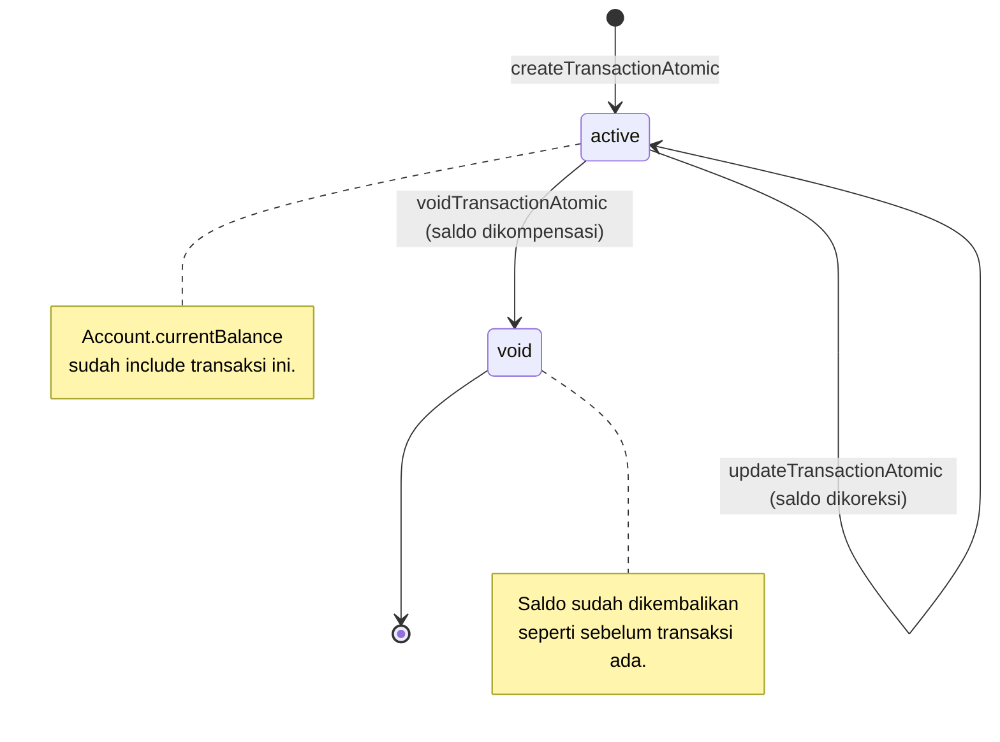
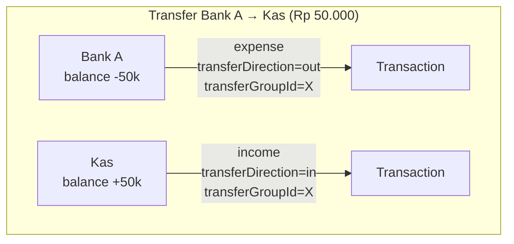

# 4. Domain Keuangan

> Kuadran: **Explanation** — invariant utama domain (saldo, transaksi, kategori, transfer, void) dan alasannya.

CatatIN bukan software akuntansi formal. Domain modelnya tetap **single-entry**: satu transaksi mengubah satu akun, kecuali kasus transfer yang membuat sepasang transaksi terkait. Dokumen ini menjelaskan aturan main yang mengikat semua perubahan saldo.

## Entitas inti

| Entitas | Peran | File schema |
| --- | --- | --- |
| `Account` | Kantong uang: cash, bank, e-wallet. Memegang `currentBalance`. | `schema.prisma:193-210` |
| `Category` | Klasifikasi income/expense. | `schema.prisma:212-226` |
| `Transaction` | Semua perubahan saldo: income, expense, adjustment, transfer (sebagai pasangan). | `schema.prisma:228-256` |
| `BalanceAdjustment` | Detail penyesuaian saldo manual (1-1 dengan transaction tipe `adjustment`). | `schema.prisma:258-270` |

Semua entitas di atas wajib di-scope `tenantId`. Tidak ada akun atau kategori "global".

## Tipe transaksi & sumber

`TransactionType` (`schema.prisma:65-69`):

- `income` — uang masuk; menambah `currentBalance` akun.
- `expense` — uang keluar; mengurangi `currentBalance` akun.
- `adjustment` — penyesuaian saldo manual; saldo target tidak dihitung dari nominal, melainkan dari `BalanceAdjustment.newBalance`.

`TransactionSource` (`schema.prisma:71-75`):

- `web` — input lewat UI web/mobile.
- `whatsapp` — input lewat bot WhatsApp.
- `adjustment` — dihasilkan oleh fitur "Sesuaikan saldo".

`TransactionStatus`:

- `active` — saldo sudah memperhitungkan transaksi ini.
- `void` — transaksi dibatalkan; saldo sudah dikompensasi balik.

> **Tidak ada penghapusan keras.** Transaksi yang salah harus di-`void`, bukan di-`DELETE`. Ini menjaga audit trail tetap utuh dan reversibel.

## Invariant 1 — saldo selalu konsisten dengan transaksi aktif

`Account.currentBalance` adalah angka yang dipersist, bukan hasil agregat real-time. Kebenarannya dijaga oleh tiga aturan:

1. **Insert transaksi** harus dilakukan lewat `createTransactionAtomic` (`services/transaction.service.js:21-127`). Fungsi ini membuka `prisma.$transaction`, insert `Transaction`, lalu update `currentBalance` di update yang sama.
2. **Void transaksi** harus dilakukan lewat `voidTransactionAtomic` (`services/transaction.service.js:213-287`). Saldo dikompensasi terbalik (income → kurangi, expense → tambah). Untuk `adjustment`, saldo dipulihkan ke `previousBalance` dari `BalanceAdjustment`.
3. **Update transaksi** lewat `updateTransactionAtomic` (`services/transaction.service.js:289-393`). Selisih (`oldDelta` vs `newDelta`) diaplikasikan ke akun lama dan akun baru jika berbeda.

Konsekuensi: **tidak ada path lain yang boleh menulis ke `Transaction` atau `Account.currentBalance`**. Saat redesign, ikuti pola "semua menulis lewat service".

## Invariant 2 — kategori cocok dengan tipe transaksi

`createTransactionAtomic` memvalidasi:
- Jika `type === 'income'`, `category.type` harus `income`.
- Jika `type === 'expense'`, `category.type` harus `expense`.
- Jika `categoryId` null, transaksi tetap valid (kategori opsional).

Saat user mencoba update transaksi expense menjadi kategori income, request ditolak (`transaction.service.js:331-332`).

## Invariant 3 — transfer adalah dua transaksi terkait

Transfer antar akun direpresentasikan sebagai **sepasang transaksi**:
- Satu `expense` di `fromAccount` dengan `transferDirection = 'out'`.
- Satu `income` di `toAccount` dengan `transferDirection = 'in'`.
- Keduanya berbagi `transferGroupId` (UUID acak).

Aturan:
- Akun asal harus punya saldo cukup (`createTransferAtomic` cek `from.currentBalance >= amount`, `transaction.service.js:153`).
- `categoryId` selalu null (transfer tidak punya kategori).
- Filter list transaksi per akun otomatis menampilkan kedua sisi transfer (lihat `transactions.routes.js:60-66`).
- Saat menampilkan list, frontend menggabungkan pasangan menjadi satu baris "Transfer A → B" (lihat `frontend/src/pages/Transactions.jsx:114-127`).
- Void salah satu sisi mem-void seluruh group (`transaction.service.js:221-247`).

> **Transfer tidak bisa di-edit.** Hanya bisa di-void. Untuk koreksi, void dulu lalu buat transfer baru.

## Invariant 4 — penyesuaian saldo bukan sekadar update angka

Saat user mengubah saldo lewat tombol "Sesuaikan saldo" (UI) atau `POST /api/accounts/:id/adjust-balance`, backend **membuat transaksi tipe `adjustment`** dengan amount = `|newBalance - previousBalance|` dan menyertakan `BalanceAdjustment` (1-1) yang menyimpan:

- `previousBalance` — saldo sebelum penyesuaian.
- `newBalance` — saldo target.
- `difference` — selisih signed (boleh negatif).
- `reason` — alasan teks dari user.

Implementasi: `accounts.routes.js:141-175`. Hasilnya: histori penyesuaian tetap muncul di list transaksi dengan badge `adjustment`, dan void akan memulihkan saldo ke `previousBalance`.

## Invariant 5 — akun & kategori "soft delete" jika sudah dipakai

`DELETE /api/accounts/:id` dan `DELETE /api/categories/:id` akan:
- **Soft-deactivate** (set `status = 'inactive'`) jika sudah punya transaksi terkait.
- **Hard delete** hanya jika belum dipakai.

Lihat `accounts.routes.js:116-139` dan `categories.routes.js:74-93`. Tujuannya adalah menjaga foreign key `Transaction.accountId` / `Transaction.categoryId` tetap valid dan histori tetap bisa dibaca.

Akun inactive masih bisa muncul di list (`GET /api/accounts`) tapi tidak bisa dipilih untuk transaksi baru — `createTransactionAtomic` menolak akun non-aktif (`transaction.service.js:50`).

## Default tenant baru

Setiap tenant baru otomatis mendapat:

- 1 akun: `Kas Tunai` (type cash, balance 0, default = true).
- Kategori income: Gaji, Penjualan, Bonus, Modal, Lainnya.
- Kategori expense: Makan, Transportasi, Belanja, Tagihan, Operasional, Listrik, Internet, Sewa, Gaji Karyawan, Lainnya.

Sumber: `backend/src/config/defaults.js`. Diaplikasikan di tiga tempat yang membuat tenant: `auth.routes.js` (register & self-create), `admin.routes.js` (admin platform create tenant), dan `prisma/seed.js`.

## Periode dan timezone

Operasi pelaporan dan filter waktu menggunakan `dayjs` di server tanpa konfigurasi timezone eksplisit—artinya **menggunakan timezone server**. Mode produksi disarankan setting `TZ=Asia/Jakarta` di container backend untuk mencocokkan ekspektasi user Indonesia.

Helper:
- `getPeriodRange(period)` (`utils/period.js`) — konversi label `today | yesterday | this_week | last_week | this_month | last_month | this_year` menjadi `{ from, to, label }`.
- `parseIndonesianDate(text)` (`utils/date-parser.js`) — parser tanggal Bahasa Indonesia untuk command WhatsApp ("kemarin", "10 Mei", "tanggal 5", dll). Lihat [Reference: WA grammar](../reference/wa-command-grammar.md).

## Hubungan dengan plan & limit

Lihat `backend/src/config/plans.js`. Aturan:

| Type | Plan | Max users | Max accounts | WhatsApp bot |
| --- | --- | --- | --- | --- |
| personal | free | 1 | 2 | ✗ |
| personal | basic | 1 | 5 | ✓ |
| personal | pro | 2 | 8 | ✓ |
| umkm | free | 1 | 2 | ✗ |
| umkm | basic | 3 | 5 | ✓ |
| umkm | pro | 20 | 30 | ✓ |

Plan diperiksa di endpoint pembuatan akun (`accounts.routes.js:48-52`) dan pembuatan user (`settings.routes.js:408-414`). Tenant dengan `subscriptionStatus` `inactive`/`suspended`/trial expired ditolak oleh middleware `requireActiveSubscription`.

## Audit log

Setiap perubahan penting menulis ke `AuditLog`:

- `transaction.create.{type}` — saat `createTransactionAtomic` dipanggil.
- `transaction.update`, `transaction.void`, `transaction.transfer`, `transaction.transfer.void`.
- `tenant.register`, `tenant.self_create`, `tenant.self_delete`, `tenant.admin_create`, `platform_admin.tenant.delete`.
- `user.delete`, `platform_admin.user.{create,update,delete,reset_whatsapp}`.
- `whatsapp.link`, `identity.switch_tenant`.

Audit log tidak dipakai oleh business logic (read-only history). Cocok untuk fitur "history" di redesign masa depan.

## Lanjut baca

- [API transactions](../reference/api/transactions.md) — endpoint detail.
- [API accounts](../reference/api/accounts.md) — termasuk `adjust-balance`.
- [How-to: tambah laporan & export](../how-to/tambah-laporan-export.md).
- [WhatsApp bot](./06-whatsapp-bot.md) — bagaimana bot membuat transaksi yang patuh invariant ini.
