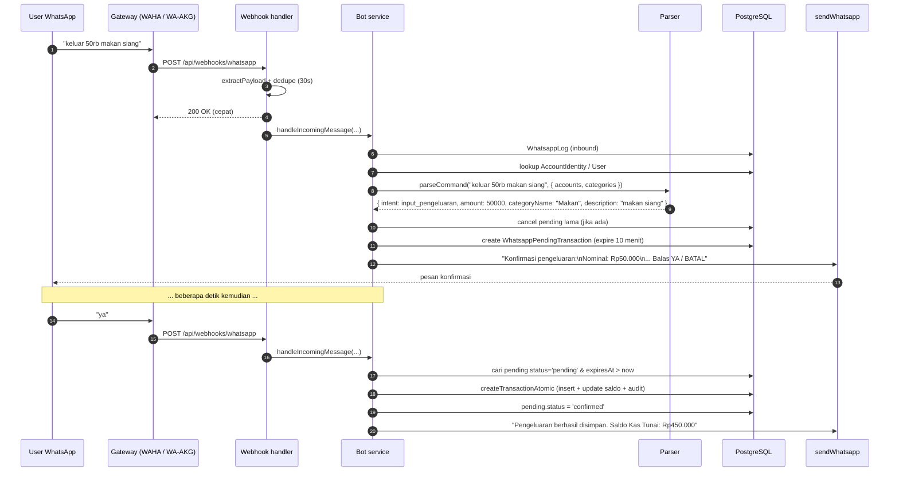

# 6. WhatsApp Bot

> Kuadran: **Explanation** — bagaimana bot WhatsApp di CatatIN bekerja dari pesan masuk sampai transaksi tersimpan, dan kenapa desainnya seperti itu.

Bot WhatsApp adalah channel kerja utama CatatIN, bukan sekadar fitur tambahan. Dokumen ini fokus ke **flow** dan **alasan**; daftar lengkap perintah ada di [Reference: WA grammar](../reference/wa-command-grammar.md), sedangkan parser dibahas di [AI Parser](./07-ai-parser.md).

## Daftar intent yang didukung

`parser.js:3-4` mendefinisikan intent berikut:

| Intent | Contoh perintah | Aksi |
| --- | --- | --- |
| `cek_saldo` | `saldo`, `saldo bca` | Tampilkan total saldo + per akun |
| `cek_pengeluaran` | `pengeluaran hari ini`, `pengeluaran bulan ini` | Aggregate pengeluaran + top kategori |
| `cek_pemasukan` | `pemasukan minggu ini` | Aggregate pemasukan + top kategori |
| `riwayat_transaksi` | `riwayat hari ini`, `transaksi terakhir 10` | Tampilkan daftar transaksi aktif terbaru |
| `input_pengeluaran` | `keluar 50rb makan siang` | Buat pending → konfirmasi → simpan |
| `input_pemasukan` | `terima 1jt proyek` | Sama, untuk pemasukan |
| `transfer_akun` | `transfer Bank A ke Kas 50rb`, `tarik tunai BCA 200rb` | Pending transfer |
| `cek_hutang` / `cek_piutang` | `cek hutang`, `piutang` | Tampilkan saldo hutang/piutang global |
| `catat_hutang` / `bayar_hutang` | `catat hutang 500rb dari BCA`, `bayar hutang 200rb dari BCA` | Pending transaksi hutang |
| `catat_piutang` / `terima_piutang` | `catat piutang 300rb ke BCA`, `terima piutang 300rb ke BCA` | Pending transaksi piutang |
| `konfirmasi` | `ya`, `oke`, `iya` | Eksekusi pending |
| `batal` | `batal`, `cancel` | Batalkan pending |
| `help` | `help`, `bantuan`, `menu`, `perintah` | Kirim daftar contoh |
| `unknown` | _selain di atas_ | Kirim help dengan prefix "Saya tidak mengerti..." |

Tambahan command lain di luar intent parser:
- `link CATATIN-123456` — eksklusif untuk link flow (`whatsapp-bot.service.js:59-62`).
- Balasan `YA` / `BATAL` saat ada `WhatsappLinkRequest` pending — masuk handler khusus (`whatsapp-bot.service.js:64-109`).

## Alur "happy path": catat pengeluaran

Empat keputusan desain penting di alur ini:

### 1. Webhook membalas 200 dulu, proses kemudian
`webhooks.routes.js:113-118` mengirim `res.status(200).json({ ok: true })` **sebelum** memanggil `handleIncomingMessage`. Tujuannya:
- Mencegah retry storm dari WAHA / AKG yang menunggu respon ≤ beberapa detik.
- Membuat handler tidak terblokir oleh I/O backend.

Trade-off: jika handler error, tidak ada response yang menunjukkan ke gateway. Error dilog ke console + tabel `WhatsappLog` (`whatsapp-bot.service.js:117`).

### 2. Dedup berbasis `messageId`
Webhook menyimpan `Map` in-memory `recentWebhookKeys` (TTL 30 detik) untuk membuang duplikat. Dedup key:
- `messageId` jika ada,
- atau `${normalizedFrom}:${text}` sebagai fallback.

Ini cukup untuk volume kecil. Pada deploy multi-instance, dedup ini **tidak konsisten** antar pod—lihat ADR-007 untuk migrasi ke Redis-based dedup.

### 3. Pending confirmation, bukan eksekusi langsung
Sebelum benar-benar membuat transaksi, bot membuat `WhatsappPendingTransaction` dan meminta konfirmasi `YA`. Alasan:
- Parser bisa salah baca; konfirmasi memberi user kesempatan koreksi.
- User mendapat ringkasan: nominal, kategori, akun, tanggal.
- Jika user tidak respon dalam `WA_PENDING_EXPIRES_MINUTES` (default 10), pending kadaluarsa.

Pending lama otomatis di-`cancelled` saat user mengirim command baru yang membuat pending baru (`whatsapp-bot.service.js:507-510`). Ini mencegah bertumpuknya pending yang membingungkan.

### 4. Logging dwi-arah ke `WhatsappLog`
Setiap pesan masuk dan setiap balasan bot ditulis ke `WhatsappLog` (lihat helper `logWA` di `whatsapp-bot.service.js:22-30`). Untuk pesan keluar, intent dan meta hasil parser ikut disimpan. Tujuan:
- Debug: lihat raw message dan parser output.
- Statistik: admin platform bisa hitung pemakaian command WA.

Saat redesign, lihat data ini sebagai golden source untuk training parser.

## Path otorisasi sebelum command diproses

Sebelum mencapai parser, bot menjalankan rangkaian gate (`whatsapp-bot.service.js:143-167`):

1. User ditemukan? Jika tidak → balas "WhatsApp belum terhubung".
2. `user.tenantId` ada? Jika tidak → balas "belum punya tenant aktif".
3. `user.status === 'active'`? Jika tidak → balas "akun tidak aktif".
4. `tenant.status !== 'inactive'`? Jika ya → balas "tenant tidak aktif".
5. `subscriptionStatus !== 'inactive' | 'suspended'`? Jika ya → balas "langganan tidak aktif".
6. Jika `subscriptionStatus === 'trial'` dan `trialEndsAt < now` → balas "trial berakhir".
7. Plan punya `whatsappBot: true`? Jika tidak → balas "fitur WA mulai plan Basic".

Hanya setelah semua gate hijau, parser dipanggil. Konsekuensi UX: user free-plan yang mencoba kirim command tetap mendapat balasan informatif, bukan diabaikan.

## Multi-jalur identifikasi pengirim

`whatsapp-bot.service.js:111-141` mencoba menemukan user dengan **beberapa kandidat**:

- `candidateNumbers`: kombinasi nomor dari `from`, `chatId`, `author`, `to`, dll. setelah `normalizeWhatsappNumber`.
- `candidateValues`: nilai mentah termasuk JID `@c.us` / `@lid`.

Lookup mencoba:
1. `AccountIdentity.whatsappNumber IN (kandidat)` ATAU `whatsappJid IN (kandidat JID)`.
2. Jika identity punya `activeTenantId`, ambil `User` di tenant tersebut.
3. Jika belum ketemu, fallback ke `User` legacy (langsung match `whatsappNumber` / `whatsappJid`).

Kompleksitas ini ada karena WhatsApp Business API + WAHA mengirim format JID berbeda di tipe pesan berbeda (group vs DM, regular vs `@lid` Linked Devices). Saat redesign, **jangan menyederhanakan tanpa testing dengan data WAHA real** — banyak edge case sudah ditangani di sini.

## Pesan grup WAHA

Untuk pesan grup, webhook membedakan dua identitas:

- `chatId` grup (`...@g.us`) sebagai target balasan.
- participant pengirim (`...@c.us` atau `...@lid`) sebagai identitas user CatatIN.

`webhooks.routes.js` mengekstrak participant dari beberapa kemungkinan field (`author`, `participant`, `sender.id`, `_data.author`, `_data.participant`, `key.participant`) lalu meneruskan `replyTo` sebagai `chatId` grup. Jika participant tidak cocok dengan user yang sudah terhubung, bot diam agar tidak spam grup.

Webhook juga memanggil `sendWhatsappSeen` secara best-effort. Untuk grup, payload WAHA memakai `chatId` grup, `messageIds` pesan grup, dan `participant` pengirim. Jika `sendSeen` gagal, command bot tetap diproses.

## Pemilihan akun & kategori saat input

`handleInputTransaksi` (`whatsapp-bot.service.js:451-539`) menentukan akun & kategori dengan urutan prioritas:

**Akun**:
1. `accountId` dari parser (jika nama akun disebut di pesan).
2. Akun default tenant (`isDefault = true`, `status = 'active'`).
3. Akun aktif pertama.

**Kategori**:
1. `categoryId` dari parser (match nama atau heuristic mapping).
2. Kategori `Lainnya` di tipe yang sesuai.
3. Kategori pertama di tipe tersebut.

Jika tidak ada akun aktif sama sekali, bot membalas "Tidak ada akun aktif. Silakan buat akun di web terlebih dahulu."

## Penanganan transfer di bot

Transfer punya path khusus karena membutuhkan dua akun. `handleTransferAkun` (`whatsapp-bot.service.js:541-619`):

- Memilih `from` & `to` dari hasil parser.
- Jika `from === to` → tolak.
- Jika salah satunya tidak terdeteksi:
  - Untuk `tarik tunai` dengan multi-akun kas, kirim disambiguasi.
  - Untuk umum, kirim daftar akun.
- Build description dengan fallback `Transfer X ke Y`, atau `tarik tunai X` / `setor tunai Y` sesuai keyword.
- Buat `WhatsappPendingTransaction` dengan `parsedPayload.kind = 'transfer'`.

Saat user kirim `YA`, `handleConfirmPending` mendeteksi `payload.kind === 'transfer'` dan memanggil `createTransferAtomic` alih-alih `createTransactionAtomic`.

## Help message

Help dipanggil di tiga kasus:
- Intent `help` eksplisit.
- Intent `unknown` (parser tidak yakin).
- User pertama kali yang baru link akun (lihat balasan `handleLinkToken` / `handleLinkRequestReply`).

Help hard-coded di `sendHelp` (`whatsapp-bot.service.js:621-661`). Saat redesign, pertimbangkan menjadikan template help **adaptif**:
- Tampilkan nama akun user supaya contoh terasa personal.
- Tampilkan command spesifik plan (mis. user UMKM dapat contoh "tarik tunai", personal dapat contoh "transfer ke Dana").

## Trade-off & batasan saat ini

| Aspek | Saat ini | Implikasi |
| --- | --- | --- |
| Concurrency | Pesan diproses inline di proses Express | Throughput terbatas; satu pesan lambat bisa block lain |
| Dedup | In-memory Map per instance | Tidak aman untuk deploy multi-instance |
| Bahasa | Hanya Bahasa Indonesia | Parser akan gagal di pesan English/Jawa |
| Group chat | Didukung untuk WAHA jika payload punya `chatId` grup dan participant | Perlu testing payload real per engine/versi WAHA |
| Media | Hanya text body diparse (caption gambar tidak khusus) | Bukti foto belum bisa otomatis dilampirkan |
| Edit transaksi via WA | Tidak ada | Edit hanya via web |
| Notifikasi proaktif | Tidak ada | Bot pasif murni; tidak push reminder |

Beberapa di antaranya cocok dijadwalkan untuk fase berikutnya. Lihat [Roadmap](../roadmap.md).

## Lanjut baca

- [Tata bahasa command WhatsApp](../reference/wa-command-grammar.md) — referensi lengkap.
- [AI parser](./07-ai-parser.md) — cara parser memutuskan intent.
- [Adapter provider](./08-adapter-wa-provider.md) — kontrak `send()` & cara provider berbeda.
- [How-to: tambah intent baru](../how-to/tambah-intent-whatsapp.md).
- [How-to: debug bot tanpa gateway](../how-to/debug-bot-tanpa-gateway.md).
