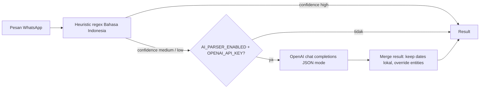

# 7. AI Command Parser

> Kuadran: **Explanation** — strategi dua-tingkat (heuristic Bahasa Indonesia + fallback OpenAI), kenapa demikian, dan bagaimana confidence dipakai.

Parser adalah jantung pengalaman bot WhatsApp: dia mengubah pesan bebas seperti `keluar 50rb makan siang kemarin` menjadi struktur `{ intent, entities }` yang bisa dikerjakan oleh handler. File: `backend/src/services/whatsapp/parser.js`.

## Strategi dua-tingkat



Alasan strategi ini:

- **Heuristic murah & cepat.** Tidak ada call jaringan, deterministik, sangat baik untuk command yang formatnya sudah jelas (mis. user yang sudah terbiasa).
- **OpenAI mahal & lambat.** Hanya perlu untuk pesan ambigu atau bahasa kasual yang kompleks.
- **Bisa hidup tanpa OpenAI.** Saat `OPENAI_API_KEY` kosong atau `AI_PARSER_ENABLED=false`, parser tetap berjalan—hanya saja akurasi lebih rendah pada input ambigu.
- **Tetap deterministik untuk tanggal.** Date parsing dipertahankan dari heuristic (`enhanceWithOpenAI` mengabaikan tanggal dari AI untuk mencegah halusinasi tanggal).

## Bentuk hasil parser

```js
{
  intent: 'cek_saldo' | 'cek_pengeluaran' | 'cek_pemasukan'
        | 'input_pengeluaran' | 'input_pemasukan' | 'transfer_akun'
        | 'konfirmasi' | 'batal' | 'help' | 'unknown',
  entities: {
    amount: number | null,
    period: 'today' | 'yesterday' | 'this_week' | 'last_week'
          | 'this_month' | 'last_month' | 'this_year' | null,
    accountId: string | null,
    accountName: string | null,
    fromAccountId: string | null,    // hanya untuk transfer
    fromAccountName: string | null,
    toAccountId: string | null,
    toAccountName: string | null,
    cashAccountCount: number | undefined, // hanya transfer (untuk disambiguasi)
    categoryId: string | null,
    categoryName: string | null,
    description: string | null,
    date: 'YYYY-MM-DD' | null,
    dateText: string | null,         // teks asli yang menjadi date
  },
  confidence: 'high' | 'medium' | 'low',
  source: 'heuristic' | 'openai',
}
```

## Heuristic: bagian yang dikerjakan secara lokal

### Normalisasi
`normalize(text)` (parser.js:27-29) lowercase, strip accent, dan rapikan whitespace. Ini meredam variasi kapitalisasi & diakritik.

### Deteksi nominal (`parseNominal`)
Pola yang dipahami:
| Input | Hasil |
| --- | --- |
| `50rb`, `50 rb`, `50 ribu`, `50k` | 50000 |
| `1jt`, `1 juta`, `2,5 juta` | 1000000, 2500000 |
| `Rp 250.000`, `250000` | 250000 |
| `2.500.000` | 2500000 (titik thousand-separator) |

Implementasi: parser.js:39-56. Trik: titik di posisi `\.(?=\d{3}(?:\D|$))` di-strip sebagai pemisah ribuan, sedangkan koma diubah jadi titik desimal. Tidak ada dukungan mata uang non-IDR.

### Deteksi periode (`detectPeriod`)
Regex kasar: `hari ini`, `hr ini`, `kemarin`, `minggu (ini|lalu)`, `bulan (ini|lalu)`, `tahun ini`. Lihat parser.js:58-68.

### Deteksi tanggal (`parseIndonesianDate`)
Diserahkan ke `utils/date-parser.js`. Pola yang dimengerti:
- `hari ini`, `kemarin`, `tadi pagi/siang/sore/malam`.
- ISO `2026-05-10`.
- Numerik lokal `10/05/2026`, `10-05-26`.
- `tanggal 10`, `tgl 10` (bulan & tahun ambil sekarang).
- `10 Mei`, `10 Mei 2026`, termasuk varian singkat `Jan/Feb/...`.

Tanggal dari heuristic **tidak akan ditimpa** oleh hasil OpenAI.

### Deteksi intent (`detectIntent`)
Urutan pemeriksaan (parser.js:70-104):
1. Konfirmasi/batal/help — exact match list kata.
2. Saldo — keyword `saldo`, `cek saldo`, `berapa saldo`.
3. Transfer — verba transfer + nominal.
4. Cek pengeluaran/pemasukan — keyword tanpa nominal.
5. Input pengeluaran/pemasukan — verba + nominal.
6. Fallback "ada nominal + verba beli/bayar" → expense.
7. Otherwise → `unknown`.

Verba di-list di tiga konstanta:
- `INCOME_VERBS`: `masuk, pemasukan, terima, dapat, gajian, jual, jualan, ...`.
- `EXPENSE_VERBS`: `keluar, pengeluaran, bayar, beli, belanja, catat pengeluaran, ...`.
- `TRANSFER_VERBS`: `transfer, tf, pindah, mindahin, mutasi, tarik tunai, setor tunai`.

Termasuk variasi typo umum (`pemasukn`, `pngeluaran`, `kluar`). Saat menambah verba baru, perhatikan: heuristic adalah string contains—kata pendek bisa false-positive (mis. `tf` tidak di-anchor). Lihat [How-to: tambah intent](../how-to/tambah-intent-whatsapp.md).

### Pemetaan kategori & akun
`guessCategory` dan `guessAccount` (parser.js:106-154) memilih dengan dua langkah:

1. **Substring match** dengan nama akun/kategori tenant. Pemenang adalah yang nama paling panjang (untuk menghindari ambigu — "Kas" bisa cocok dengan "Kas Tunai" dan "Kas Cabang").
2. **Mapping heuristik** untuk kata umum:

```js
{
  makan: 'Makan', jajan: 'Makan', kopi: 'Makan', warung: 'Makan',
  bensin: 'Transportasi', grab/gojek/ojek: 'Transportasi',
  belanja/market: 'Belanja',
  listrik/pln: 'Listrik',
  internet/wifi/indihome: 'Internet',
  sewa/kontrakan: 'Sewa',
  gaji/salary: 'Gaji',
  jual/jualan/penjualan: 'Penjualan',
  bonus: 'Bonus',
  modal: 'Modal',
}
```

Jika tenant punya kategori dengan nama persis (case-insensitive), mapping akan menemukannya. Default categories di `defaults.js` sudah selaras dengan mapping ini.

### Resolusi transfer (`guessTransferAccounts`)
Lebih kompleks karena bisa mention 2 akun. Pola yang dipahami:
- `dari A ke B` / `from A to B`.
- `pindah A B` (urutan: from kemudian to).
- `tarik tunai BankA` → if hanya 1 akun kas tersedia, gunakan otomatis sebagai tujuan.
- `setor tunai BankA` → simetris.

Saat ambigu (banyak akun kas), bot meminta klarifikasi alih-alih menebak.

### Description cleanup (`guessDescription`)
Setelah intent dan entitas terdeteksi, parser membersihkan teks dari:
- Verba (keluar, masuk, bayar, dll).
- Token periode dan tanggal.
- Token nominal & `Rp`.
- Nama akun yang sudah dikenali (akun jadi entity, tidak perlu di description).
- Kata transfer (`dari`, `ke`, `menuju`, dll) untuk transfer.

Hasil bersih ini dipakai sebagai `description` transaksi. Jika kosong, handler akan jatuh ke teks asli (`whatsapp-bot.service.js:488-491`).

## Confidence: kapan AI dipakai

`heuristicParse` set confidence (parser.js:317-323):
- `konfirmasi`, `batal`, `help`, `cek_saldo` → `high`.
- `cek_*` → `high` jika ada periode, `medium` kalau tidak.
- `input_*` → `high` jika ada nominal **dan** kategori, `medium` kalau hanya nominal, `low` kalau tidak ada keduanya.
- `transfer_akun` → `high` jika nominal+from+to, `medium` jika nominal saja, `low` lainnya.

Logika gabungan di `parseCommand` (parser.js:430-434):

```js
const base = heuristicParse(text, context);
if (base.confidence === 'high') return base;
return enhanceWithOpenAI(text, base, context);
```

Artinya: hanya 1 round-trip ke OpenAI maksimum, dan hanya untuk pesan yang heuristic sudah bingung.

## Bagian yang dikerjakan OpenAI

`enhanceWithOpenAI` (parser.js:343-428):

- Model default: `gpt-4o-mini` (env `OPENAI_MODEL`).
- `response_format: { type: 'json_object' }`.
- `temperature: 0` untuk konsistensi.
- System prompt menjelaskan struktur JSON yang diharapkan dan variasi nominal Indonesia.
- User prompt mengirim pesan + daftar akun & kategori tenant.

Setelah respon datang:
- Match `categoryName` AI ke `Category` tenant case-insensitive.
- Match `accountName`, `fromAccountName`, `toAccountName` ke `Account`.
- Override entities yang null/lemah dari heuristic.
- **Tanggal heuristic dipertahankan** (`baseResult.entities.date || parsed.date || null`).

Jika OpenAI gagal (network, parse error, dsb), fallback ke heuristic dan log warning. Tidak menggagalkan request user.

## Tabel keputusan: contoh hasil

| Input pesan | Intent | Amount | Category | Account | Confidence | Source |
| --- | --- | --- | --- | --- | --- | --- |
| `saldo` | `cek_saldo` | - | - | - | high | heuristic |
| `pengeluaran bulan ini` | `cek_pengeluaran` | - | - | - | high | heuristic |
| `pengeluaran` | `cek_pengeluaran` | - | - | - | medium | heuristic |
| `keluar 50rb makan siang` | `input_pengeluaran` | 50000 | Makan | default | high | heuristic |
| `bayar 25k parkir` | `input_pengeluaran` | 25000 | (mapping miss?) | default | medium | likely → AI |
| `terima 1jt proyek` | `input_pemasukan` | 1000000 | - | default | medium | likely → AI |
| `tadi gw beli kopi 30rb` | `input_pengeluaran` | 30000 | Makan | default | medium | heuristic→AI override |
| `transfer bca ke kas 100rb` | `transfer_akun` | 100000 | - | from BCA / to Kas | high | heuristic |
| `kemarin kasi gaji asisten 500rb` | `input_pengeluaran` (via category) | 500000 | Gaji Karyawan? | default | medium | likely → AI |

## Apa yang tidak dilakukan parser

- **Tidak menormalisasi nama brand** ke akun (mis. `Bank BCA` ≠ akun bernama `BCA` jika tidak di-config). User perlu menamai akun dengan kata yang biasa diketik.
- **Tidak menebak nominal dari konteks**. Misalnya `bayar parkir biasa` tanpa angka → tetap minta klarifikasi.
- **Tidak memahami operasi aritmatika** (`bagi 3`, `total 5 hari × 50rb`).
- **Tidak menyimpan history percakapan** untuk konteks. Setiap pesan diparse independen kecuali ada pending transaksi.
- **Tidak mengenali bahasa selain Indonesia/English campuran biasa.** Bahasa daerah / slang regional tergantung mapping.

## Pengujian heuristic

`parser.js:436` mengekspor `__test = { parseNominal, detectIntent, detectPeriod, heuristicParse }` untuk testing. Saat ini belum ada test runner di `package.json`—saat menambah parser logic, pertimbangkan:
- Pakai Vitest atau Jest sebagai harness.
- Buat fixture JSON: input pesan + expected `intent` & `entities`.
- Test heuristic sebelum AI agar regresi tidak tertutupi response OpenAI.

## Lanjut baca

- [WhatsApp bot](./06-whatsapp-bot.md) — bagaimana hasil parser dipakai handler.
- [Reference: WA grammar](../reference/wa-command-grammar.md) — daftar pola yang didukung.
- [How-to: tambah intent baru](../how-to/tambah-intent-whatsapp.md).
- [Env variables: AI parser](../reference/env-variables.md#ai-parser).
