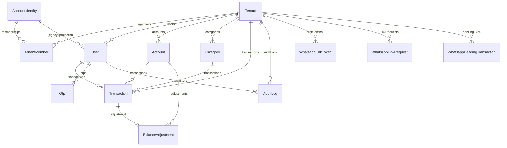

# Skema Database

> Kuadran: **Reference** — semua model Prisma, field, relasi, dan index. Sumber: `backend/prisma/schema.prisma`.

## Konvensi umum

- Semua ID adalah `String @id @default(cuid())`.
- Timestamp (`createdAt`, `updatedAt`) ada di hampir semua model.
- Money menggunakan `Decimal @db.Decimal(18, 2)`.
- Multi-tenant: hampir semua model bisnis memiliki `tenantId` dan index `@@index([tenantId])`.
- Soft delete: `deletedAt` (nullable DateTime) atau status enum.

## Enum

```prisma
enum TenantType         { personal, umkm }
enum SubscriptionStatus { active, suspended, trial, inactive }
enum SubscriptionPlan   { free, basic, pro }
enum UserRole           { owner, admin, member, platform_admin }
enum UserStatus         { active, inactive }
enum AccountType        { cash, bank, ewallet }
enum AccountStatus      { active, inactive }
enum CategoryType       { income, expense }
enum CategoryStatus     { active, inactive }
enum TransactionType    { income, expense, adjustment }
enum TransactionSource  { web, whatsapp, adjustment }
enum TransactionStatus  { active, void }
enum TransferDirection  { out, in }
enum PendingStatus      { pending, confirmed, cancelled, expired }
enum LinkRequestStatus  { pending, confirmed, cancelled, expired }
```

## Diagram relasi (high-level)



## `AccountIdentity`

Identitas WhatsApp lintas tenant.

| Field | Tipe | Catatan |
| --- | --- | --- |
| `id` | String @id | cuid |
| `name` | String | nama display |
| `whatsappNumber` | String @unique | format `62...` (lihat `normalizeWhatsappNumber`) |
| `whatsappJid` | String? @unique | JID asli dari provider, nullable sampai linked |
| `activeTenantId` | String? | FK → Tenant; tenant terakhir di-aktifkan |
| `status` | UserStatus | `active` / `inactive` |
| `createdAt`, `updatedAt` | DateTime | auto |

Index:
- `@@index([activeTenantId])`

Relasi:
- `activeTenant` → `Tenant`
- `memberships` → `TenantMember[]`
- `legacyUsers` → `User[]`

## `TenantMember`

Junction Identity ↔ Tenant dengan role per tenant.

| Field | Tipe | Catatan |
| --- | --- | --- |
| `id` | String @id | cuid |
| `accountId` | String | FK → AccountIdentity |
| `tenantId` | String | FK → Tenant |
| `role` | UserRole | `owner`/`admin`/`member` (tidak `platform_admin`) |
| `status` | UserStatus | active/inactive |
| `deletedAt` | DateTime? | soft delete |
| `createdAt`, `updatedAt` | DateTime | auto |

Constraints & index:
- `@@unique([accountId, tenantId])`
- `@@index([tenantId])`
- `@@index([accountId])`

## `Tenant`

Entitas keuangan (workspace personal atau UMKM).

| Field | Tipe | Catatan |
| --- | --- | --- |
| `id` | String @id | cuid |
| `name` | String | nama tenant |
| `type` | TenantType | `personal` / `umkm` |
| `subscriptionPlan` | SubscriptionPlan | default `free` |
| `subscriptionStatus` | SubscriptionStatus | default `trial` |
| `trialEndsAt` | DateTime? | jika status `trial` |
| `status` | String | `"active"` / `"inactive"` (string, bukan enum karena warisan) |
| `deletedAt` | DateTime? | soft delete |
| `createdAt`, `updatedAt` | DateTime | auto |

## `User`

Proyeksi identity di tenant tertentu (lihat [Multi-tenant](../explanation/03-model-multitenant.md)).

| Field | Tipe | Catatan |
| --- | --- | --- |
| `id` | String @id | cuid |
| `tenantId` | String? | FK → Tenant. `platform_admin` boleh null. |
| `identityId` | String? | FK → AccountIdentity. Null untuk legacy users. |
| `name` | String | |
| `whatsappNumber` | String | dinormalisasi |
| `deletedWhatsappNumber` | String? | nilai asli sebelum delete (untuk audit) |
| `whatsappJid` | String? | dimirror dari identity |
| `role` | UserRole | dimirror dari `TenantMember.role` |
| `status` | UserStatus | dimirror dari `TenantMember.status` |
| `deletedAt` | DateTime? | soft delete |
| `createdAt`, `updatedAt` | DateTime | auto |

Index:
- `@@index([tenantId])`
- `@@index([identityId])`
- `@@index([whatsappNumber])`
- `@@index([whatsappJid])`

## `Account`

Kantong uang.

| Field | Tipe | Catatan |
| --- | --- | --- |
| `id` | String @id | |
| `tenantId` | String | FK |
| `name` | String | |
| `type` | AccountType | `cash`/`bank`/`ewallet` |
| `openingBalance` | Decimal(18,2) | saldo awal |
| `currentBalance` | Decimal(18,2) | **dipersist & diupdate atomik** |
| `isDefault` | Boolean | hanya satu boleh true per tenant (enforced di route logic) |
| `status` | AccountStatus | `active`/`inactive` |
| `createdAt`, `updatedAt` | DateTime | auto |

Index: `@@index([tenantId])`

## `Category`

Kategori income/expense.

| Field | Tipe | Catatan |
| --- | --- | --- |
| `id` | String @id | |
| `tenantId` | String | FK |
| `name` | String | unik per `(tenantId, name, type)` (enforced di route, bukan DB) |
| `type` | CategoryType | `income`/`expense` |
| `isDefault` | Boolean | true untuk kategori bawaan |
| `status` | CategoryStatus | `active`/`inactive` |

Index: `@@index([tenantId])`

## `Transaction`

Sumber kebenaran perubahan saldo.

| Field | Tipe | Catatan |
| --- | --- | --- |
| `id` | String @id | |
| `tenantId` | String | FK |
| `userId` | String | FK → User |
| `accountId` | String | FK → Account |
| `type` | TransactionType | `income`/`expense`/`adjustment` |
| `amount` | Decimal(18,2) | selalu positif; tanda ditentukan `type` |
| `categoryId` | String? | nullable; null untuk transfer & adjustment |
| `transactionDate` | DateTime | tanggal user-facing (bisa beda dari `createdAt`) |
| `description` | String? | |
| `source` | TransactionSource | `web`/`whatsapp`/`adjustment` |
| `status` | TransactionStatus | `active`/`void` |
| `transferGroupId` | String? | UUID, sama untuk pasangan transfer |
| `transferDirection` | TransferDirection? | `out`/`in` saat bagian dari transfer |
| `attachmentUrl` | String? | path relatif ke `/uploads/...` |
| `createdAt`, `updatedAt` | DateTime | auto |

Index:
- `@@index([tenantId, transactionDate])` — untuk laporan + pagination per tenant
- `@@index([accountId])`
- `@@index([categoryId])`
- `@@index([transferGroupId])`

## `BalanceAdjustment`

Detail penyesuaian saldo manual (1-1 dengan `Transaction` tipe `adjustment`).

| Field | Tipe | Catatan |
| --- | --- | --- |
| `id` | String @id | |
| `transactionId` | String @unique | FK |
| `accountId` | String | FK → Account |
| `previousBalance` | Decimal(18,2) | saldo sebelum |
| `newBalance` | Decimal(18,2) | saldo sesudah |
| `difference` | Decimal(18,2) | signed `newBalance - previousBalance` |
| `reason` | String | wajib |
| `createdAt` | DateTime | auto |

## `WhatsappPendingTransaction`

Transaksi yang menunggu konfirmasi `YA`/`BATAL` dari WA.

| Field | Tipe | Catatan |
| --- | --- | --- |
| `id` | String @id | |
| `tenantId` | String | FK |
| `userId` | String | FK |
| `whatsappNumber` | String | nomor user (replyTo) |
| `rawMessage` | String | pesan asli |
| `parsedPayload` | Json | hasil parser + akun/kategori dipilih |
| `status` | PendingStatus | `pending`/`confirmed`/`cancelled`/`expired` |
| `expiresAt` | DateTime | `now + WA_PENDING_EXPIRES_MINUTES` |
| `createdAt`, `updatedAt` | DateTime | auto |

Index: `@@index([userId, status])`

## `Otp`

Disiapkan untuk audit; **alur produksi memakai Redis, bukan tabel ini** (lihat `services/otp.service.js`). Tabel tetap ada untuk kompatibilitas.

| Field | Tipe | Catatan |
| --- | --- | --- |
| `id` | String @id | |
| `userId` | String? | FK |
| `whatsappNumber` | String | |
| `otpHash` | String | bcrypt |
| `expiresAt` | DateTime | |
| `attempts` | Int | default 0 |
| `usedAt` | DateTime? | |
| `purpose` | String | `login`/`register` |

Index: `@@index([whatsappNumber])`

## `AuditLog`

Audit perubahan penting. Tidak dipakai oleh business logic (read-only history).

| Field | Tipe | Catatan |
| --- | --- | --- |
| `id` | String @id | |
| `tenantId` | String? | nullable untuk action platform admin |
| `userId` | String? | nullable jika system action |
| `action` | String | mis. `transaction.create.expense`, `tenant.register` |
| `entityType` | String | mis. `transaction`, `tenant`, `user` |
| `entityId` | String? | id entitas terkait |
| `oldValue` | Json? | snapshot sebelum |
| `newValue` | Json? | snapshot sesudah |
| `createdAt` | DateTime | auto |

Index: `@@index([tenantId])`

### Daftar `action` yang tertulis di kode

- `transaction.create.income` / `transaction.create.expense` / `transaction.create.adjustment`
- `transaction.update`
- `transaction.void`
- `transaction.transfer`
- `transaction.transfer.void`
- `tenant.register`
- `tenant.self_create`
- `tenant.self_delete`
- `tenant.admin_create`
- `platform_admin.tenant.delete`
- `platform_admin.user.create` / `update` / `delete` / `reset_whatsapp`
- `user.delete`
- `whatsapp.link`
- `identity.switch_tenant`

## `WhatsappLog`

Log dwi-arah pesan WhatsApp.

| Field | Tipe | Catatan |
| --- | --- | --- |
| `id` | String @id | |
| `tenantId` | String? | nullable; pesan dari nomor belum terdaftar |
| `whatsappNumber` | String | |
| `direction` | String | `inbound` / `outbound` |
| `message` | String | text mentah / template |
| `intent` | String? | hasil parser untuk inbound, intent handler untuk outbound |
| `meta` | Json? | bisa berisi parser result lengkap |
| `createdAt` | DateTime | auto |

Index:
- `@@index([tenantId])`
- `@@index([whatsappNumber])`

## `WhatsappLinkToken`

Token kode `CATATIN-XXXXXX` untuk hubungkan WA → akun.

| Field | Tipe | Catatan |
| --- | --- | --- |
| `id` | String @id | |
| `tenantId` | String | FK |
| `userId` | String | FK |
| `token` | String @unique | format `CATATIN-XXXXXX` |
| `expiresAt` | DateTime | `now + 10m` |
| `usedAt` | DateTime? | set saat berhasil link |
| `createdAt` | DateTime | auto |

Index: `@@index([tenantId])`, `@@index([userId])`

## `WhatsappLinkRequest`

Request konfirmasi link (alur "balas YA" otomatis).

| Field | Tipe | Catatan |
| --- | --- | --- |
| `id` | String @id | |
| `tenantId` | String | FK |
| `userId` | String | FK |
| `whatsappNumber` | String | nomor target |
| `status` | LinkRequestStatus | `pending`/`confirmed`/`cancelled`/`expired` |
| `expiresAt` | DateTime | `now + 5m` |
| `confirmedAt` | DateTime? | |
| `confirmedJid` | String? | JID asli yang menjawab YA |
| `createdAt`, `updatedAt` | DateTime | auto |

Index:
- `@@index([tenantId])`
- `@@index([userId, status])`
- `@@index([whatsappNumber, status])`

## Lanjut baca

- [Domain keuangan](../explanation/04-domain-keuangan.md) — invariant.
- [How-to: tambah tabel Prisma](../how-to/tambah-tabel-prisma.md).
- [Multi-tenant](../explanation/03-model-multitenant.md).
