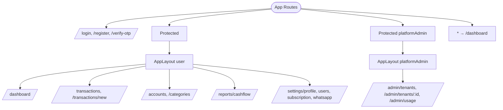

# Frontend Routes

> Kuadran: **Reference** — daftar route React Router, guard, dan halaman → API mapping. Source: `frontend/src/App.jsx`, `components/AppLayout.jsx`, `pages/*.jsx`.

## Bentuk routing

Routing memakai `react-router-dom` v6 dengan dua nested layout (user & platform admin) plus 3 route public (login/register/verify). Semua di-mount dari `App.jsx`.



## Guard `Protected`

```jsx
function Protected({ children, platformAdmin = false }) {
  const { user, loading } = useAuth();
  if (loading) return <div>Memuat...</div>;
  if (!user) return <Navigate to="/login" />;
  if (platformAdmin && user.role !== 'platform_admin') return <Navigate to="/dashboard" />;
  if (!platformAdmin && user.role === 'platform_admin') return <Navigate to="/admin/tenants" />;
  return children;
}
```

Konsekuensi:
- User belum login → `/login`.
- Platform admin masuk ke route user → otomatis ke `/admin/tenants`.
- User biasa masuk ke `/admin/*` → otomatis ke `/dashboard`.

## Daftar route

### Public

| Route | Komponen | Catatan |
| --- | --- | --- |
| `/login` | `pages/Login.jsx` | Form nomor + button kirim OTP |
| `/register` | `pages/Register.jsx` | Form data + nomor + business name |
| `/verify-otp` | `pages/VerifyOtp.jsx` | Form 6 digit OTP |

### User (di dalam `AppLayout`)

| Route | Komponen | Endpoint utama yang dipakai |
| --- | --- | --- |
| `/dashboard` | `pages/Dashboard.jsx` | `GET /dashboard/summary`, `/dashboard/recent-transactions`, `/accounts`, `/reports/cashflow` |
| `/transactions` | `pages/Transactions.jsx` | `GET/POST /transactions`, `POST /transactions/transfer`, `PATCH/POST .../void` |
| `/transactions/new` | `pages/NewTransaction.jsx` | `POST /transactions` |
| `/accounts` | `pages/Accounts.jsx` | `GET/POST/PATCH/DELETE /accounts`, `POST /accounts/:id/adjust-balance` |
| `/categories` | `pages/Categories.jsx` | `GET/POST/PATCH/DELETE /categories` |
| `/reports/cashflow` | `pages/CashflowReport.jsx` | `GET /reports/cashflow`, `/reports/cashflow/export` |
| `/settings/profile` | `pages/SettingsProfile.jsx` | `GET/PATCH /settings/profile` |
| `/settings/users` | `pages/SettingsUsers.jsx` | `GET/POST/PATCH/DELETE /settings/users` (owner/admin saja) |
| `/settings/subscription` | `pages/SettingsSubscription.jsx` | `GET /settings/subscription` |
| `/settings/whatsapp` | `pages/SettingsWhatsapp.jsx` | `GET /settings/whatsapp`, link-token / link-request |

### Admin platform (di dalam `AppLayout` mode admin)

| Route | Komponen | Endpoint utama |
| --- | --- | --- |
| `/admin/tenants` | `pages/AdminTenants.jsx` | `GET /admin/tenants`, `POST /admin/tenants`, `PATCH /admin/tenants/:id/status`, `PATCH .../subscription` |
| `/admin/tenants/:id` | `pages/AdminTenantDetail.jsx` | `GET /admin/tenants/:id`, plus user CRUD |
| `/admin/usage` | `pages/AdminUsage.jsx` | `GET /admin/usage` |

### Catch-all

`*` → redirect ke `/dashboard`. Konsekuensi: setelah login, route invalid otomatis kembali ke dashboard.

## Sidebar nav (di `AppLayout.jsx`)

### Mode user

```js
navUser = [
  { to: '/dashboard', label: 'Dashboard' },
  { to: '/transactions', label: 'Transaksi' },
  { to: '/transactions/new', label: '+ Tambah' },
  { to: '/accounts', label: 'Akun' },
  { to: '/categories', label: 'Kategori' },
  { to: '/reports/cashflow', label: 'Laporan' },
];
navSettings = [
  { to: '/settings/profile', label: 'Profil' },
  { to: '/settings/users', label: 'Pengguna', roles: ['owner', 'admin'] },
  { to: '/settings/subscription', label: 'Subscription' },
  { to: '/settings/whatsapp', label: 'WhatsApp' },
];
```

### Mode platform admin

```js
navAdmin = [
  { to: '/admin/tenants', label: 'Tenants' },
  { to: '/admin/usage', label: 'Usage' },
];
```

Item nav dengan `roles` array hanya tampil jika `user.role` ada di array tersebut.

## Sidebar widget

- **Tenant switcher**: tampil jika user punya > 1 tenant. Memanggil `switchTenant(tenantId)` dari `AuthContext`, yang melakukan `POST /auth/switch-tenant` lalu `window.location.reload()`.
- **Buat Tenant Baru**: tombol di sidebar memunculkan modal yang memanggil `POST /auth/tenants`. Setelah sukses, set token baru dan navigate ke `/dashboard`.
- **Logout**: `POST /auth/logout` (best-effort) lalu `setToken(null)` + redirect `/login`.

## Modal global di `AppLayout`

- **Aktifkan WhatsApp**: muncul setelah login jika plan basic/pro tapi `whatsappJid` belum ada (`sessionStorage.catatin_show_whatsapp_prompt`).
- **Buat Tenant Baru**: dipanggil dari sidebar.

## Token + interceptor

`frontend/src/lib/api.js`:
- `axios.create({ baseURL: '/api' })`.
- Token otomatis di-inject lewat `Authorization: Bearer ${token}` (dari `localStorage.catatin_token`).
- Response interceptor:
  - 401 → drop token + redirect `/login` (kecuali sudah di `/login`).
  - 403 + pesan `"Langganan tidak aktif"`/`"Masa trial sudah berakhir"`/`"Tenant tidak aktif"` → toast + redirect `/settings/subscription`.
  - 4xx/5xx lain → toast error.

`AuthContext` memuat user via `GET /auth/me` saat boot.

## Vite proxy & build

- Dev: `vite.config.js` proxy `/api` & `/uploads` ke `VITE_API_PROXY` (default `http://localhost:4000`).
- Prod: nginx container front-of-frontend mem-proxy `/api` & `/uploads` ke `catatin-backend:4000` (lihat `frontend/nginx.conf`).

## Lanjut baca

- [Frontend komponen](./frontend-komponen.md).
- [How-to: tambah halaman frontend](../how-to/tambah-halaman-frontend.md).
